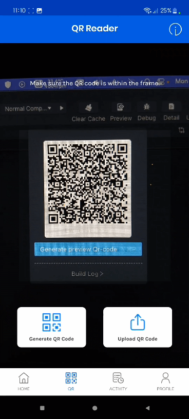
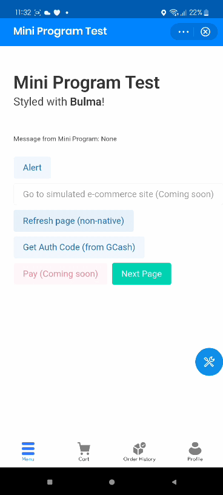

# Mini Program's WebView Mocking Server

For GCash & other AliPay-powered Mini Programs

## Testing

### Requirements

- NodeJS 12
- pnpm (run `npm install -g pnpm`)

### Run

- Run `pnpm run index`

## To-Dos

Please refer to issues tab on Github
